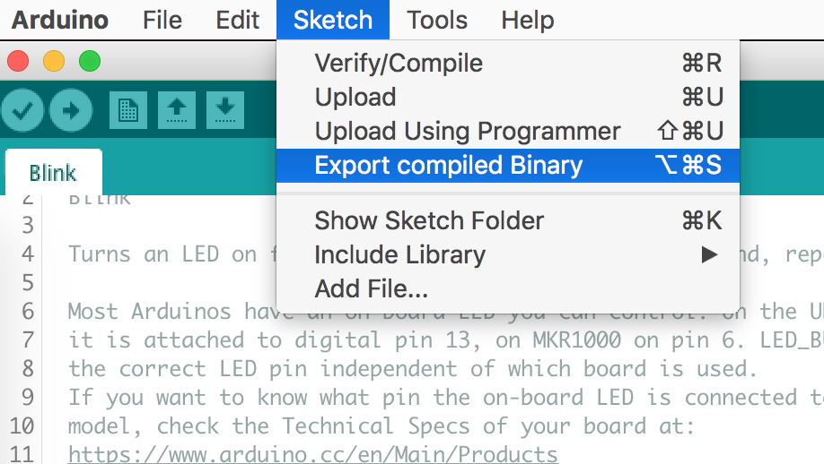
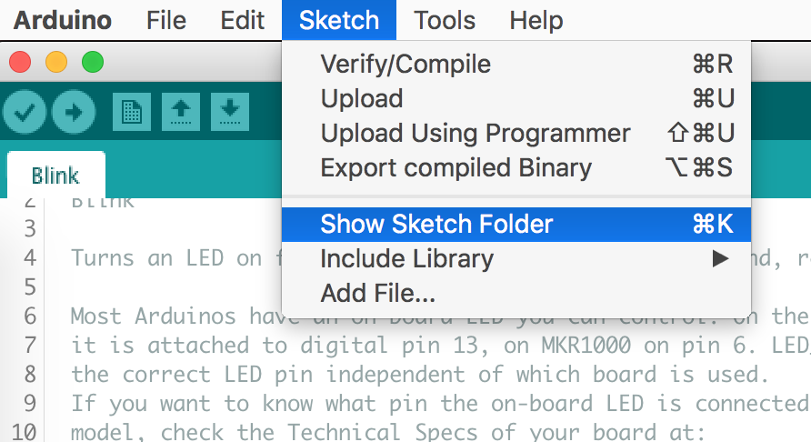

# arduino-web-uploader
Upload compiled hex files to your boards directly from a webpage. (Chrome only)

Try it now without having to install anything at [https://dbuezas.github.io/arduino-web-uploader/](https://dbuezas.github.io/arduino-web-uploader/)
(Chrome only, any pc OS. Android, not yet)

Currently supports these boards:

- avr4809
- lgt8f328p (see https://github.com/dbuezas/lgt8fx)
- uno (atmega328p)
- nano
- nano with old bootloader (most chinese clones)
- pro mini

## The Web Serial API is available on all desktop platforms (Chrome OS, Linux, macOS, and Windows) in Chrome 89.

## Import directly into HTML

Just add the following to the head of your HTML:

```html
<script src="https://github.com/dbuezas/arduino-web-uploader/releases/download/v1.0.0/main.js"></script>
```

And add some buttons with their corresponding attributes

```html
<button
  arduino-uploader
  hex-href="[path to your hex file]"
  board="[name of the board]"
  [optional]verify
  [optional]port-filters='[{"usbProductId":46388,"usbVendorId":1241}]'
>
  > Upload blinker to lgt8f328p and verify uploaded code
  <span class="upload-progress"></span>
</button>
```

### Where:

#### [`arduino-uploader`]

indicates to the library that it should attach the functionality to this button

#### [`hex-href`]

is the url of the hex file to upload. Let me know in the issues if you have a use case to let the user select a hex file from their own computer.

#### [`board`]

can be any of these:

- `"lgt8f328p"`
- `"nanoOldBootloader"`
- `"nano"`
- `"uno"`
- `"proMini"`

(here are the definitions: https://github.com/dbuezas/arduino-web-uploader/blob/master/src/index.ts#L13-L44. You can see that nano, uno and proMini have the same parameters.)

#### [`verify`]

Is **optional**, so you can chose to leave that attribute out or write it there. In my experience, uploads never get corrupted and removing verification makes it twice as fast.

(here are the definitions: https://github.com/dbuezas/arduino-web-uploader/blob/master/src/index.ts#L13-L44. You can see that nano, uno and proMini have the same parameters.)

#### [`port-filters`]

**Optional**, used to limit the devices shown in the connection popup.
To find out the IDs of a device, enter this in the browser console

```js
port = await navigator.serial.requestPort({})
console.log(JSON.stringify([port.getInfo()]))
```

#### `<span class="upload-progress"></span>`

Is a placeholder element where progress percentage will be shown

### for example:

```html
<button arduino-uploader hex-href="./blinker.nano.hex" board="pro-mini">
  Upload blinker to pro-mini and don't verify (faster)
  <span class="upload-progress"></span>
</button>
```

see more examples in https://github.com/dbuezas/arduino-web-uploader/blob/master/index.html

## Generating hex files




use the hex WITHOUT the bootloader.

## Using as a node module

### installation

`npm install arduino-web-uploader`
or
`yarn add arduino-web-uploader`

usage:

```js
import { upload, boards } from 'web-arduino-uploader'
document.addEventListener('button', async () => {
  const onProgress = (percentage) => {
    console.log(percentage + '%')
  }
  const verify = false // optional
  const portFilters = {} // optional, e.g. [{"usbProductId":46388,"usbVendorId":1241}]
  console.log('starting')
  await upload(boards.nanoOldBootloader, 'http://your-site.com/hex-file.hex', onProgress, verify, portFilters)
  console.log('done!')
})
```

also check the code of the stand alone html plugin: https://github.com/dbuezas/arduino-web-uploader/blob/master/src/test.ts

## Structure

- `dist/`: typescript transpiled to javascript files for npm
- `src/index.ts`: uploader code
- `src/Serial.ts`: a wrapper of navigator.serial which also emulates a node stream for compatibility
- `src/test.ts`: a wrapper of the lib to use in HTML without writing javascript (for lazy people like https://github.com/seisfeld :D)
- `test/*`: some test html file. The file `src/test.ts` is also bundled there by webpack

## download stats

https://tooomm.github.io/github-release-stats/?username=dbuezas&repository=arduino-web-uploader

## gh-pages

It looks like gihub pages lags by one commit.

## LICENSE

MIT License

Copyright (c) 2020 David Buezas

Permission is hereby granted, free of charge, to any person obtaining a copy
of this software and associated documentation files (the "Software"), to deal
in the Software without restriction, including without limitation the rights
to use, copy, modify, merge, publish, distribute, sublicense, and/or sell
copies of the Software, and to permit persons to whom the Software is
furnished to do so, subject to the following conditions:

The above copyright notice and this permission notice shall be included in all
copies or substantial portions of the Software.

THE SOFTWARE IS PROVIDED "AS IS", WITHOUT WARRANTY OF ANY KIND, EXPRESS OR
IMPLIED, INCLUDING BUT NOT LIMITED TO THE WARRANTIES OF MERCHANTABILITY,
FITNESS FOR A PARTICULAR PURPOSE AND NONINFRINGEMENT. IN NO EVENT SHALL THE
AUTHORS OR COPYRIGHT HOLDERS BE LIABLE FOR ANY CLAIM, DAMAGES OR OTHER
LIABILITY, WHETHER IN AN ACTION OF CONTRACT, TORT OR OTHERWISE, ARISING FROM,
OUT OF OR IN CONNECTION WITH THE SOFTWARE OR THE USE OR OTHER DEALINGS IN THE
SOFTWARE.
